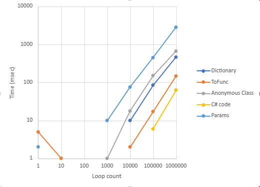

# Eval() performance


```c#
var formula = Formula.Parse("Log(x1)/Exp(2+x1)^x2");

// Dictionary : Use Dictionary<string, double> for argumetns.
var dictValue = formula.Eval(new Dictionary<string, double>
{
    {"x1", 0.1 },
    {"x2", 0.2 },
});

// Anonymous class : Use anonymous class for arguments.
var anonyValue = formula.Eval(new { x1 = 0.1, x2 = 0.2 })

// params: Arguments order is depend on Formula.GetVariables();
var pramsValue = formula.Eval(0.1, 0.2);

// ToFunc() : Emit IL code for calculation.
var func = formula.ToFunc();
var toFuncValue = func(0.1, 0.2);
```


Number of loops and execution time (msec) are :

| Loop    | Dictionary | Anonymous Class | Params | ToFunc | C# code |
| ------- | ---------- | --------------- | ------ | ------ | :-----: |
| 1       | 0          | 0               | 2      | 5      |    0    |
| 10      | 0          | 0               | 0      | 1      |    0    |
| 100     | 0          | 0               | 0      | 0      |    0    |
| 1000    | 0          | 1               | 10     | 0      |    0    |
| 10000   | 10         | 18              | 76     | 2      |    0    |
| 100000  | 85         | 150             | 451    | 17     |    6    |
| 1000000 | 463        | 665             | 2830   | 148    |   63    |


